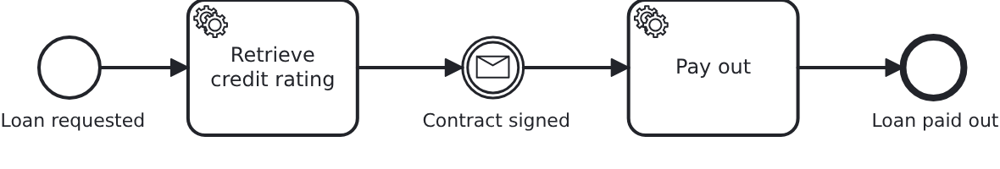

# Message correlation

[](./LICENSE)

A running workflow waits for something that happens elsewhere: a contract comes back
signed, a payment arrives, a partner answers. This blueprint shows how that news reaches
the workflow - and what of it reaches the BPMS, which is less than most people expect.

## What this blueprint shows



The loan approval of the base blueprint, waiting for the signed contract before the money
is paid out. Three things are worth looking at:

- **Nothing about the correlation is modelled.** The catch event names a message and that
  is all. VanillaBP correlates by the workflow aggregate's id, so no correlation key, no
  business key and no expression appears in the BPMN.
- **The message's content never reaches the BPMS.** `Service#contractSigned` writes who
  signed onto the aggregate FIRST and correlates afterwards. The engine learns the name of
  the message and nothing else, so everything downstream - a gateway, a later task, a
  report - reads the aggregate instead of a payload nobody can query.
- **The application decides what a second message means.** VanillaBP does not deduplicate a
  message without a correlation id, deliberately: the same message may legitimately arrive
  several times over a workflow's lifetime. Here the early return in `Service` is that
  decision, and it keeps the second delivery away from a BPMS where nothing waits for it any
  more.

Two things this blueprint deliberately does not show, and where to find them:

- **Correlation ids.** `correlateMessage(aggregate, messageName, correlationId)` tells
  several waiting occurrences of the same message apart, one per ordered item for example,
  and it deduplicates. One catch event needs none, and
  [the wiki explains the rest](https://github.com/vanillabp/adapter-platform-integration/wiki/Message-correlation#correlation-ids-several-occurrences-of-the-same-message).
- **Starting a workflow by message**, which is `bpmn-message-start`.

## Delta to the base blueprint

Compared to [`module-single`](https://github.com/vanillabp-blueprints/module-single-springboot):

|         File          |                                   What is different                                   |
|-----------------------|---------------------------------------------------------------------------------------|
| `loan_approval.bpmn`  | a message catch event the workflow waits at, and a service task behind it             |
| `Workflow.java`       | `correlateMessage`, plus the message name as a constant                               |
| `Service.java`        | writes what the message carried onto the aggregate, then correlates; refuses a repeat |
| `ApiController.java`  | the callback the message arrives at                                                   |
| `Aggregate.java`      | `contractSignedBy`, which is where the message's content ends up, and `paidOut`       |
| `LoanApprovalIT.java` | waiting, continuing, and a message arriving twice                                     |

## Running it

Requires a JDK 21. Camunda 7 is embedded, so nothing else has to run:

```bash
mvn install verify
```

Running it on another BPMS is a Maven profile, not one line of Java changes:

```bash
mvn install verify -Pcamunda8
```

Camunda 8 is a remote engine, so a cluster has to run. Start one; its address, and everything
else specific to that engine, lives in its profile file
`application/src/main/resources/application-camunda8.yaml`, with a copy for the module's own
test:

```yaml
vanillabp:
  adapters:
    camunda8:
      # Camunda 8 is a remote engine: point this at your cluster.
      rest-address: http://localhost:8080
```

That file is loaded because the Maven profile `camunda8` sets the Spring profile of the same
name, so the engine is chosen once, on the Maven command line, and the build, the tests and
`spring-boot:run` all follow it.

**On Camunda 8 the tests of this blueprint currently fail**, and not because of the
blueprint: the adapter looks a workflow up by a variable filter the search API does not
match, so correlating answers "no BPMS knows this workflow" although it does. It is
reported and being fixed; on a cluster without secondary storage the same code answers
optimistically and the blueprint runs. Camunda 7 is unaffected.

Start the application:

```bash
mvn -pl application spring-boot:run
```

Booting logs a warning per workflow module: both Camunda adapters start out with
`name-clash-avoidance: none`, so nothing keeps the identifiers of one workflow module apart
from those of another, and the adapter asks for a decision instead of picking one. One module
cannot collide with itself, so this blueprint leaves it at that. Answering the question is one
property, `vanillabp.adapters.<id>.accept-unscoped-identifiers: true`, and the modes a BPMS
offers are in
[the wiki](https://github.com/vanillabp/adapter-platform-integration/wiki/Workflow-modules#how-name-clashes-are-avoided).

Start a loan approval. This is the only URL you need:

```
http://localhost:8080/api/loan-approval/start?amount=5000
```

The process rates the request and then waits. What it logs is the URL the message arrives
at:

```
Loan approval '0f7c…' started
Credit rating of loan approval '0f7c…' is 50. The workflow now waits for the signed contract:
  Signed -> http://localhost:8080/api/loan-approval/0f7c…/contract-signed?signedBy=Jane%20Doe
```

Opening it correlates the message and the process runs to its end:

```
The contract of loan approval '0f7c…' was signed by 'Jane Doe'
Loan approval '0f7c…' was paid out to 'Jane Doe'
```

Opening the same URL a second time answers that the contract was signed already. That is the
application's decision, taken before the BPMS is asked - and the log line says so.

While the application runs on Camunda 7, Camunda's own web applications are served at

```
http://localhost:8080/camunda
```

Log in with `demo` / `demo`. Cockpit shows the instance standing at the message event,
which is the quickest way to see what "waiting" means. The user comes from
`application/src/main/resources/application-camunda7.yaml` and exists so that the
blueprint can be operated without setting one up; an application with an identity provider
of its own leaves that section out.

The Camunda 8 profile brings neither the dependency nor those settings into effect. Its
tooling is part of the cluster, and the file naming a Camunda 7 adapter id is simply not
loaded there - a profile file applies to its own engine and to no other. Naming an adapter
id whose adapter is not on the classpath is a configuration error VanillaBP refuses to
start with, and the profiles are what keeps that from happening.

## How it works

|                                          File                                          |                                            Role                                             |
|----------------------------------------------------------------------------------------|---------------------------------------------------------------------------------------------|
| `loan-approval/src/main/resources/loan-approval/processes/camunda7/loan_approval.bpmn` | the process: a message catch event naming `ContractSigned`, and a service task behind it    |
| `.../loanapproval/Service.java`                                                        | writes the message's content onto the aggregate, correlates, and refuses a repeated message |
| `.../loanapproval/Workflow.java`                                                       | `correlateMessage`, the only place `ProcessService` is used                                 |
| `.../loanapproval/ApiController.java`                                                  | the endpoint the message arrives at                                                         |
| `.../loanapproval/model/Aggregate.java`                                                | `contractSignedBy`: the single source of truth for what the message brought                 |
| `loan-approval/src/test/.../LoanApprovalIT.java`                                       | the workflow waits, the message lets it continue, a repeat is refused                       |

The order of events: the service task fills in the rating, the BPMS reaches the catch event
and the workflow stops there. Whenever the answer arrives, `ApiController` calls
`Service#contractSigned`, which loads the aggregate, writes what the message carried and
tells `Workflow` what happened. `Workflow#contractSigned` calls
`ProcessService#correlateMessage` with the aggregate and the message name, in a transaction:
on a remote BPMS the correlation is sent only after that transaction committed, so a
rollback takes it with it.

VanillaBP finds the workflow itself. It asks the configured adapters in their order of
priority and caches the answer, which is what makes the migration feature work for messages
too. If no BPMS knows the workflow, a guiding `WorkflowNotFoundException` names the likely
causes rather than losing the message silently.

The test correlating the message retries while the BPMS does not know the workflow yet. A
remote engine answers "which workflow belongs to this aggregate?" from an index it fills
asynchronously, so a message arriving seconds after the start may find nothing although the
workflow is there. An embedded engine answers immediately and the loop runs once.

## Documentation

- [Message correlation](https://github.com/vanillabp/adapter-platform-integration/wiki/Message-correlation): the API, how the workflow is found, correlation ids and idempotency
- [Correlate an incoming message](https://github.com/vanillabp/spi-for-java#correlate-an-incoming-message): the call itself
- [Workflow aggregates](https://github.com/vanillabp/adapter-platform-integration/wiki/Workflow-aggregates): why the message's content belongs there and not in the BPMS
- the wiki of the [BPMS adapter](https://github.com/vanillabp/adapter-platform-integration/wiki/BPMS-adapters) you use: what it has to arrange in the model so that correlating by the aggregate works

This blueprint is developed in the monorepo
[`blueprints`](https://github.com/vanillabp-blueprints/blueprints). This repository is a
read-only mirror, **issues and pull requests belong there.**

## Noteworthy & Contributors

[VanillaBP](https://www.github.com/vanillabp/spi-for-java) was developed by [Phactum](https://www.phactum.at) with the
intention of giving back to the community as it has benefited the community in the past.


## License

Copyright 2026 Phactum Softwareentwicklung GmbH

Licensed under the Apache License, Version 2.0
